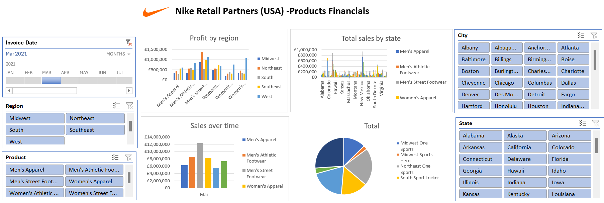

# Nancy Ntseze_Data Analytics Portfolio
# Project 1
**Title:** [HR Analytics Dashboard](https://github.com/Nancyntseze/Data-Analytics)

**Project Summary:** The HR Analytics Dashboard is a data visualization project to leverage analytics to enhance human resources management processes. I developed this project for a client in the recruitment industry. This dashboard provides actionable insights into various HR metrics, empowering organizations to make data-driven decisions for talent acquisition, employee engagement, performance evaluation, and retention strategies. By analyzing factors contributing to employee turnover, such as job satisfaction, compensation, and career development opportunities, the dashboard assists HR teams in developing targeted retention strategies to retain top talent. The customizable dashboard allows organizations to tailor it to their specific HR metrics, organizational goals, and reporting requirements.
Benefits:
-Enables data-driven decision-making in HR management.
-Identifies trends and patterns to enhance workforce planning and optimization.
-Improves employee engagement and retention through targeted interventions.
-Facilitates alignment of HR strategies with organizational objectives.
-Enhances transparency and accountability in HR processes.

**Dashboard overview:**

# Project 2
**Title:** [Groundwater Chemistry Distribution Dashboard: Enhancing Environmental Monitoring for Mining Operations](https://github.com/Nancyntseze/Data-Analytics)

**Project Summary:**  The Groundwater Chemistry Distribution Dashboard is a powerful tool developed for a mining company to monitor and analyze groundwater chemistry data. This dashboard provides real-time insights into the distribution of groundwater contaminants, enabling the mining company to effectively manage environmental impacts and comply with regulatory requirements. With these interactive maps, stakeholders can visualize the spatial distribution of contaminants across the mining site, helping identify areas of concern and prioritize remediation efforts. In addition, time-series charts and graphs track temporal trends in groundwater chemistry parameters, facilitating long-term monitoring and trend analysis for informed decision-making. More so, customizable reporting features allow users to generate tailored reports for internal stakeholders, regulatory agencies, and community engagement initiatives, promoting transparency and accountability.
The Groundwater Chemistry Distribution Dashboard serves as a vital tool for the mining company to monitor and manage groundwater quality effectively. By leveraging real-time data visualization, spatial mapping, and comprehensive analysis tools, the dashboard empowers stakeholders to make informed decisions that safeguard environmental sustainability and regulatory compliance in mining operations

**Dashboard overview:**

# Project 3
**Title:** [Groundwater Chemistry Distribution Dashboard: Enhancing Environmental Monitoring for Mining Operations](https://github.com/Nancyntseze/Data-Analytics)

**Project Summary:**  The Financial Performance Dashboard for Nike Company offers a comprehensive analysis of the company's profitability based on different retail stores, performance metrics, and efficiency indicators. Developed using pivot tables, this dashboard provides stakeholders with valuable insights into Nike's financial health and operational efficiency. The dashboard showcases the profitability of Nike's retail stores, allowing stakeholders to identify top-performing stores and regions contributing most to the company's revenue and profit margins. It also summarizes key performance indicators (KPIs) such as sales revenue, gross profit, net profit, and profit margins are visualized to assess Nike's financial performance over time. Trend analysis helps identify areas of improvement and potential growth opportunities. Additionally, the project was able to achieve the following:
-Enhanced visibility into Nike's financial performance across retail stores and regions.
-Improved decision-making by identifying top-performing stores and areas for operational optimization.
-Streamlined reporting process with interactive pivot tables, reducing time spent on data analysis and reporting.
-Facilitated data-driven discussions and strategic planning sessions among stakeholders.

**Dashboard overview:**

