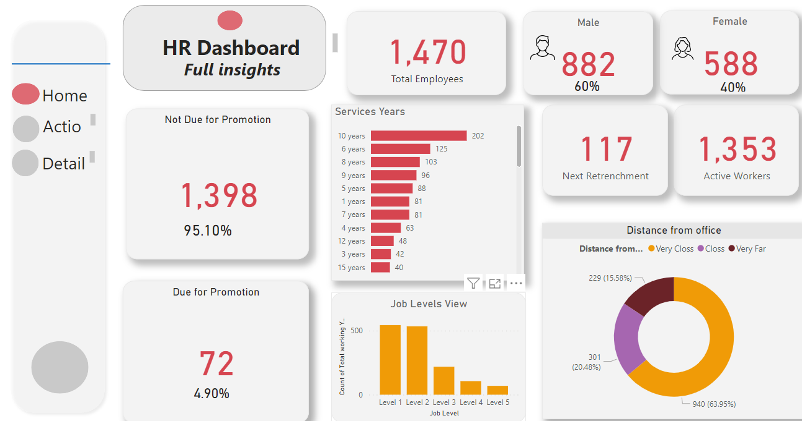
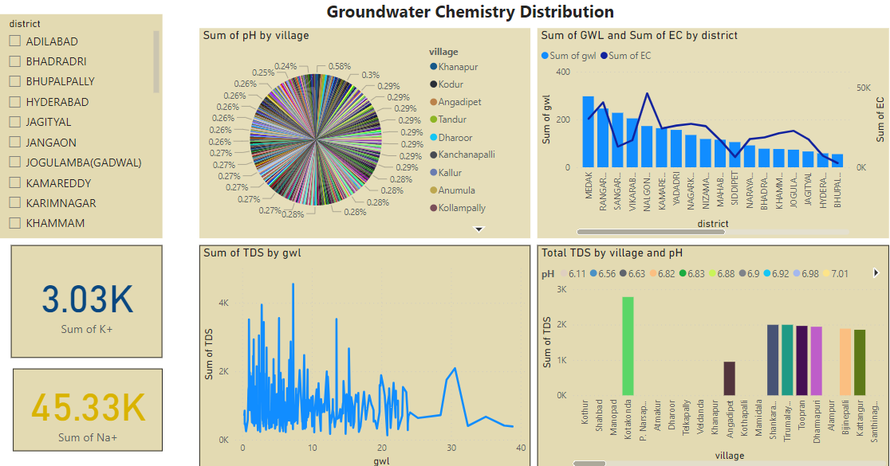

# Nancy Ntseze_Data Analytics Portfolio
# Project 1
**Title:** [HR Analytics Dashboard](https://github.com/Nancyntseze/Data-Analytics)

**Project Summary:** The HR Analytics Dashboard is a data visualization project aimed at leveraging analytics to enhance human resources management processes. Developed this project for a client in the recruitment industry. This dashboard provides actionable insights into various HR metrics, empowering organizations to make data-driven decisions for talent acquisition, employee engagement, performance evaluation, and retention strategies. By analyzing factors contributing to employee turnover, such as job satisfaction, compensation, and career development opportunities, the dashboard assists HR teams in developing targeted retention strategies to retain top talent. The dashboard is customizable, allowing organizations to tailor it to their specific HR metrics, organizational goals, and reporting requirements.

**Dashboard overview:**

# Project 2
**Title:** [Groundwater Chemistry Distribution Dashboard](https://github.com/Nancyntseze/Data-Analytics)

**Project Summary:** The project was carried out in a mining rights area where they needed to understand the water chemistry and distribution.

**Dashboard overview:**

